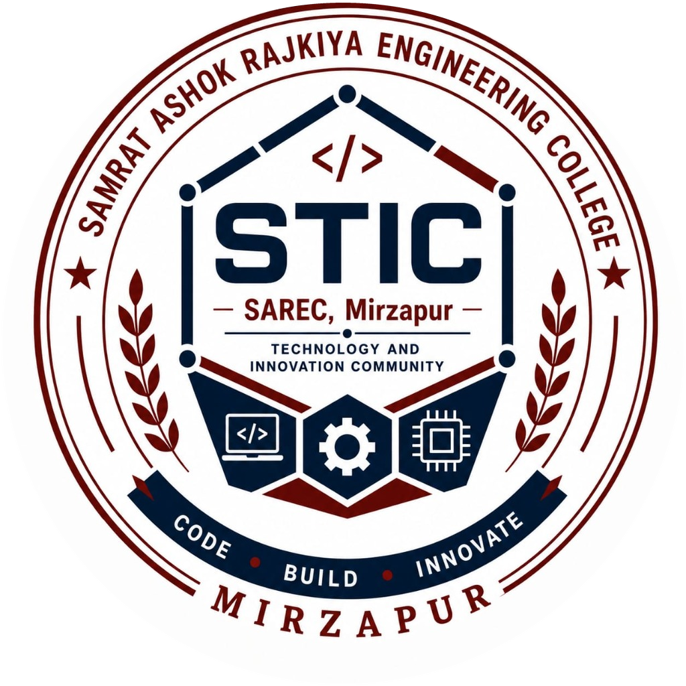

<p align="center">
  
</p>

<h1 align="center">STIC — SAREC, Mirzapur</h1>

<p align="center">
  <strong>Technology and Innovation Community</strong><br>
  <em>Code • Build • Innovate 🚀</em>
</p>


# 🚀 STIC — Technology and Innovation Community Website

Official website of **STIC (Technology and Innovation Community)**, Samrat Ashok Rajkiya Engineering College (SAREC), Mirzapur.

## 📖 About

STIC is a student-led technical community that promotes coding, development, open-source contributions, hackathons, and innovation among students at Samrat Ashok Rajkiya Engineering College, Mirzapur.

This website serves as the official platform for showcasing:

* Club activities
* Upcoming events & hackathons
* Student projects
* Core team members & mentors
* Membership registration

---

## ✨ Features

* Responsive modern UI with dark mode support
* Campus connect header with automatic theme-adaptive logo swapping
* Subtle animated mesh glow background with WCAG AA compliance
* Hero section with community overview
* Events and timeline section with dynamic `.ics` calendar generation
* Featured projects showcase
* Team members section with interactive terminal CLI profile inspector
* Social media integration
* Multi-club membership registration form
* Google Sheets integration using Google Apps Script

---

## 🛠️ Tech Stack

### Frontend Architecture

* **React 18** with **Vite** (Modern Component-Driven Architecture)
* Vanilla CSS with Custom Design System & Dark Theme variables
* HTML5 / JSX
* Vanilla JavaScript (Static version fallback)

### Backend Services

* Google Apps Script
* Google Sheets

---

## 📂 Project Structure

```text
Frontend-main/
│
├── index.html               # Static HTML platform
├── index.css                # Global design system & tokens
├── index.js                 # Static interactivity script
├── assets/
│   └── logos/
│       ├── stic-logo-light.png     # STIC light logo
│       ├── stic-logo-dark.png      # STIC dark logo
│       └── sarec-college-seal.png  # SAREC college seal
├── github.png
├── image.png
│
└── Frontend/                # ⚡ Modern React + Vite Application
    ├── index.html           # Vite root HTML
    ├── vite.config.js       # Vite build config
    ├── package.json         # React 18 & Vite dependencies
    │
    ├── public/              # Static public assets
    │   ├── assets/logos/    # Public brand assets
    │   ├── github.png
    │   └── image.png
    │
    └── src/
        ├── main.jsx         # React root entry
        ├── App.jsx          # App coordinator & state
        ├── index.css        # Modular design tokens & responsive CSS
        │
        └── components/      # Modular Functional React Components
            ├── Header.jsx           # Floating pill navbar & dark mode toggle
            ├── Hero.jsx             # Animated outline rotator & bento cards
            ├── Ticker.jsx           # Dual-layer angled scrolling marquee
            ├── ProblemGrid.jsx      # Why students get stuck bento cards
            ├── ClubsHub.jsx         # 8 specialized clubs directory & filters
            ├── CuratedOffers.jsx    # Telegram banner & application perks
            ├── Mission.jsx          # Community Tech mission & lab image
            ├── Partners.jsx         # Supported by & partner showcase
            ├── Events.jsx           # Flagship events with dynamic .ics calendar
            ├── Projects.jsx         # Featured student projects
            ├── Team.jsx             # Core leadership with CLI profile inspector
            ├── JoinForm.jsx         # Multi-club Google Apps Script form
            ├── Footer.jsx           # Footer links, college seal & tagline
            ├── FloatingWidgets.jsx  # Floating WhatsApp & analytics toast
            └── Modals.jsx           # Perk offer & Terminal CLI modals
```

---

## ⚙️ Running the Project

### Option 1: Modern React.js (Vite)

```bash
cd Frontend
npm install
npm run dev
```

The React development server will start at `http://localhost:3000/`.

### Option 2: Pure Static Version

Simply open `index.html` in your browser or run:
```bash
python -m http.server 8000
```
Open `http://localhost:8000/`.

---

## 📝 Membership Form Integration

The registration form is connected to Google Apps Script.

### Workflow

User → Website Form → Google Apps Script → Google Sheets → Confirmation Email

---

## 👥 Team

### Founding Members

* Piyush Kushwaha
* Pawan Kumar Yadav

### Faculty Coordinator

* Dileep Yadav

---

## 🌐 Social Links

### Instagram

https://www.instagram.com/stic.sarecm

### GitHub

https://github.com/stic-sarec

---

## 🤝 Contributing

Contributions are welcome.

1. Fork the repository
2. Create a new branch
3. Make changes
4. Submit a Pull Request

---

## 📧 Contact

Email: [stic.sarecm@gmail.com](mailto:stic.sarecm@gmail.com)

Location: Samrat Ashok Rajkiya Engineering College, Mirzapur

---

## 📜 License

This project is maintained by the STIC Web Team.

---

⭐ If you like this project, don't forget to star the repository.
